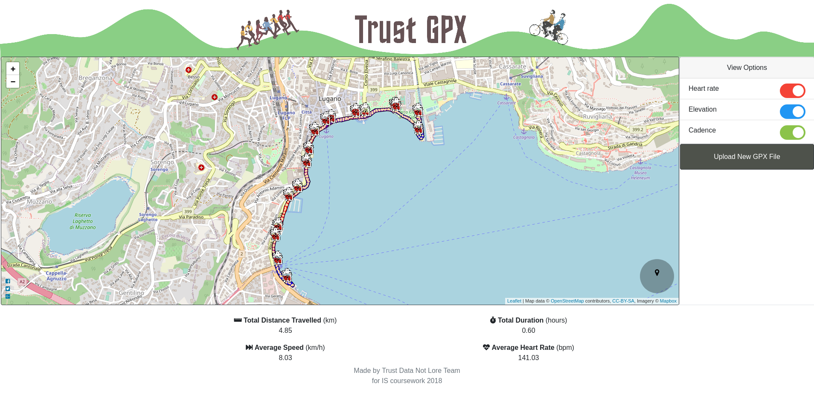

# Trust GPX

This project was to design and create a web app to visualise gpx files.

## Contributors

- Matthew McConnell
- Xavier Weiss
- Sara Jakubiak
- Gloria Dhandapani

.....other wise known as ***Trust Data Not Lore***

## How to use the social media feature

To be able to use the social media sharing icons you must run the web app  non-locally on a server domain (e.g. ngrok).

### Detailed instructions on using ngrok

The latest version of Trust GPX includes Social Media buttons
These will NOT work if the main.html is executed from a local copy

To setup a prototype:
- download ngrok ( https://ngrok.com/ )
- run python -m SimpleHTTPServer
- ngrok http 8000

Then share the [FORWARDING URL]/trust_gpx/main.html with whoever would like to use it

